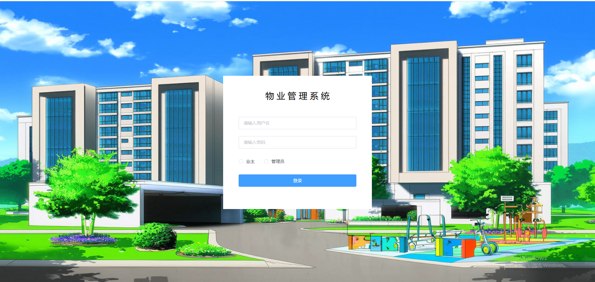
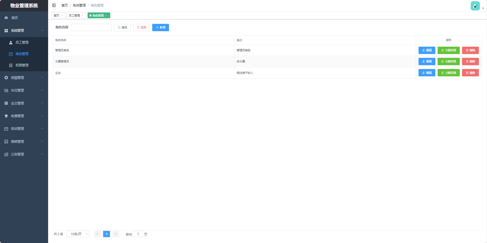
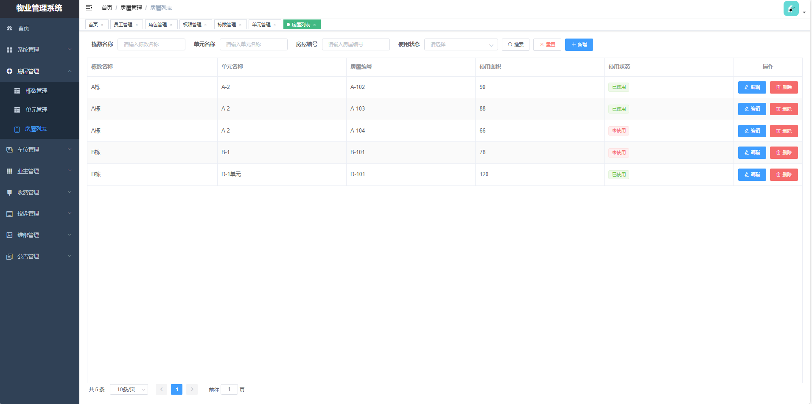
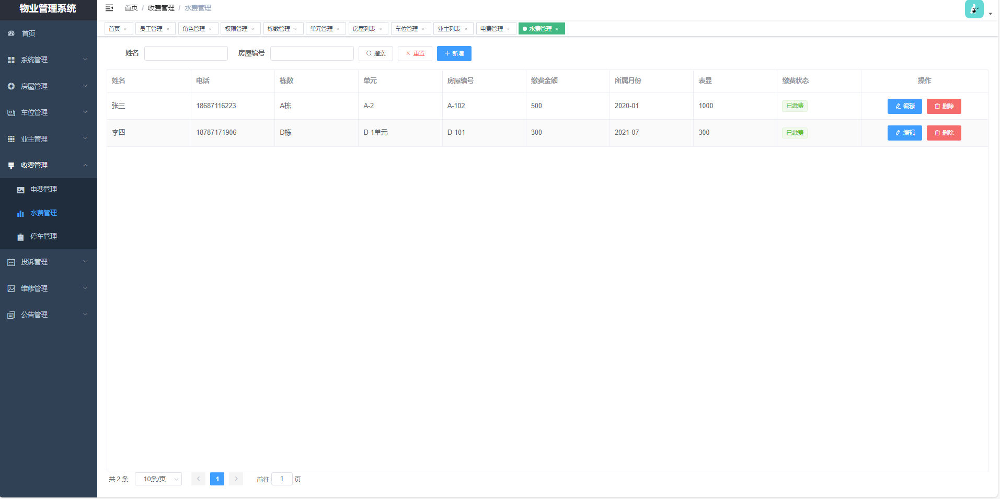
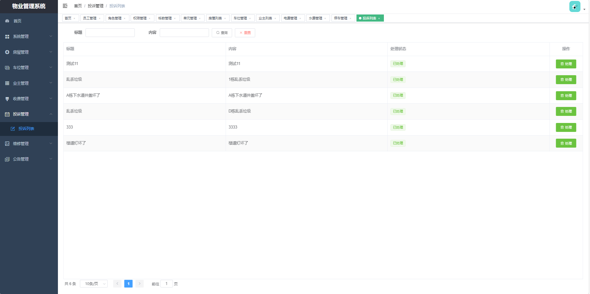
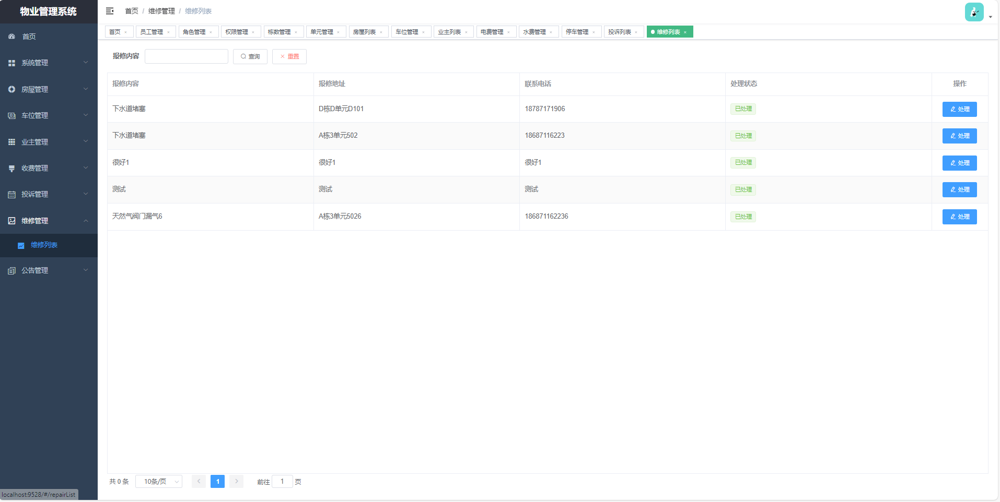
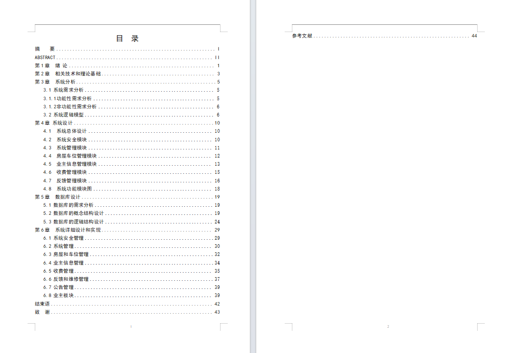
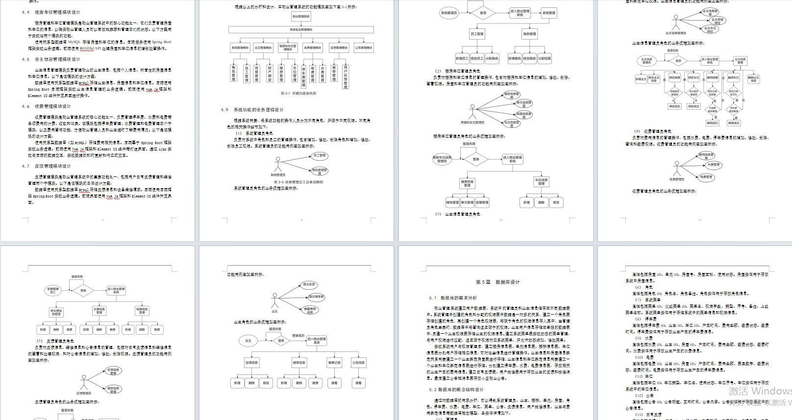

# 基于springboot+vue前后端分离的物业管理系统带万字论文

## 一、项目介绍

开发语言：java

数据库:mysql

后端技术：SpringBoot、Mybatisplus

前端技术：Vue、ElementUI

系统设计两个角色：物业、业主

物业：首页、员工管理、角色管理、权限管理、栋数管理、单元管理、房屋列表、车位管理、业主管理、电费管理、水费管理、停车管理、投诉管理、维修管理、公告管理

业主：首页、投诉管理、缴费管理（我的电费、我的水费、我的停车费）、维修管理、公告管理

### 完整项目获取

通过网盘分享的文件：物业系统

链接: https://pan.baidu.com/s/1UiI-YgmfCKXbsPdYfGZi3A?pwd=4hww 提取码: 4hww
--来自百度网盘超级会员v3的分享

通过网盘分享的文件：工具包

链接: https://pan.baidu.com/s/1YmdoJvkjoUjA75wvHLDZ6A?pwd=xm96 提取码: xm96
--来自百度网盘超级会员v3的分享

需要远程项目部署或项目修改和毕业设计也可联系（添加申请时请备注好来意）

通过网盘分享的文件：远程调试部署联系方式

链接: https://pan.baidu.com/s/1W0dDcoZmayG0c7USJDYBYg?pwd=nqd7 提取码: nqd7
--来自百度网盘超级会员v3的分享

### 项目合集(项目不断更新中)
链接: https://pan.baidu.com/s/1nY-zhvAK0CXYcn3g7LzQnQ?pwd=id3c 提取码: id3c
--来自百度网盘超级会员v3的分享

#### 这些项目一起发你了 可以分享给你需要的同学 调试可找我 也接二次修改和项目定制、毕业设计等

## 接毕业设计和论文

微信联系方式：xzxj0206  QQ：3808981644   (支持修改、 部署调试、 支持代做毕设)

接网站建设、小程序、H5、APP、各种系统等，单片机、嵌入式也可以做

选题+开题报告+任务书+程序定制+安装调试+论文+答辩ppt  都可以做

## 二、部分功能界面展示

## 三、万字文档

